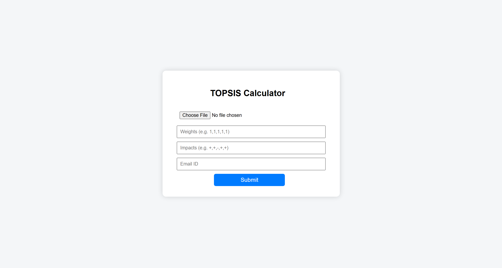
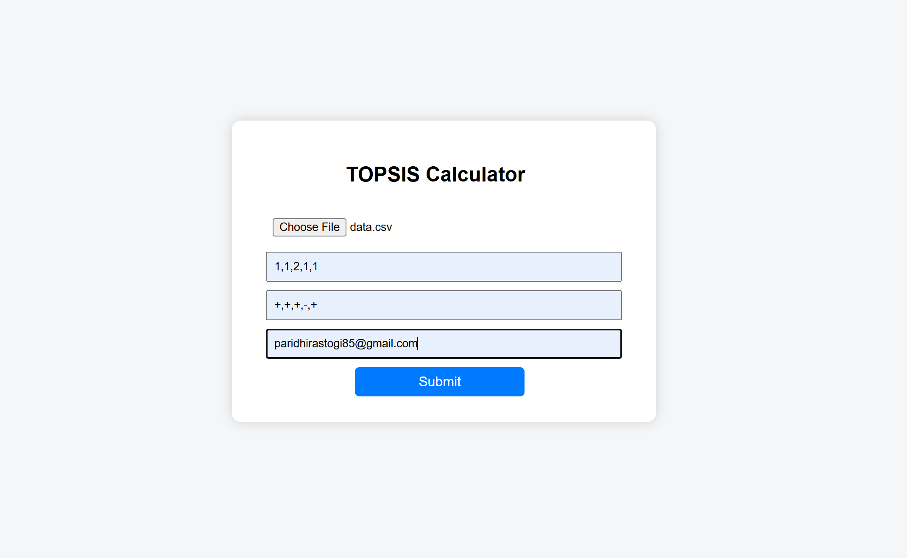
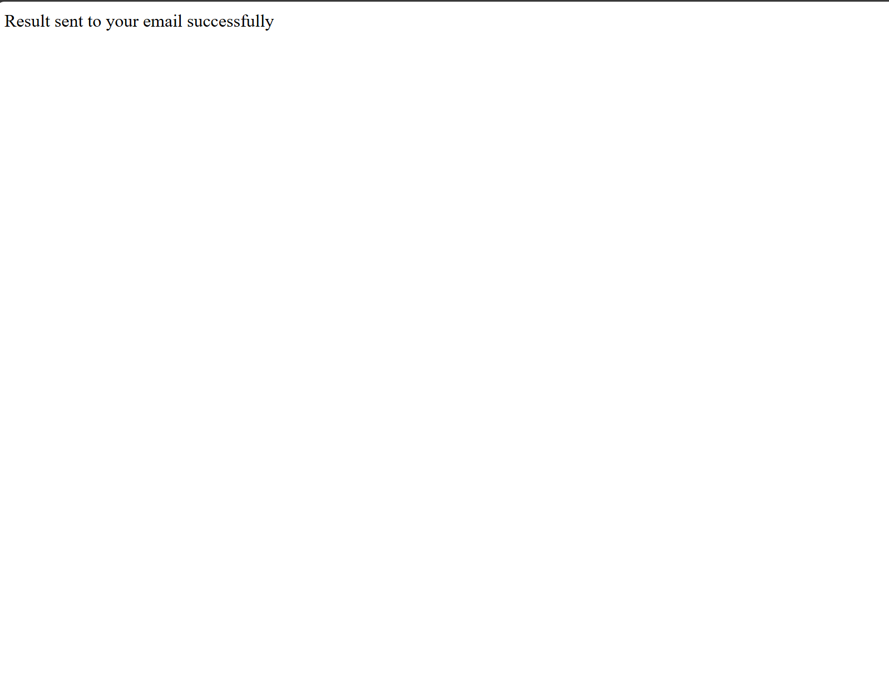
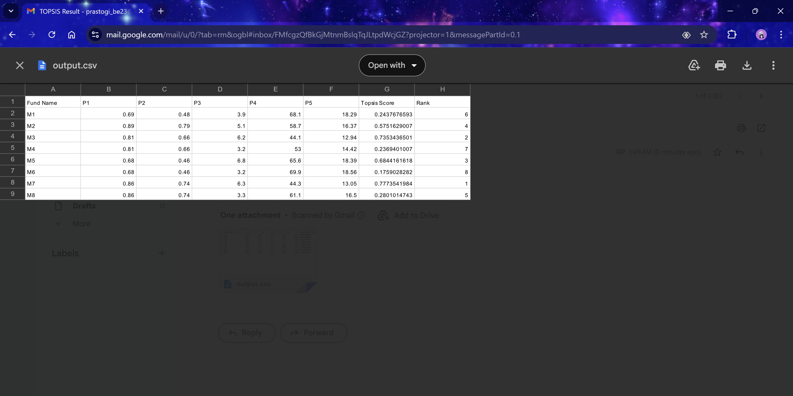

# Part III – Web service for TOPSIS

# 📊 TOPSIS Web Calculator

> A web-based Multi-Criteria Decision Making (MCDM) tool built with Flask.

This application allows users to perform **TOPSIS (Technique for Order of Preference by Similarity to Ideal Solution)** analysis on their datasets effortlessly. Users can upload a CSV file, define weights and impacts, and receive the calculated rankings directly via email.

## 🚀 Features

* **CSV File Upload:** robust handling of CSV datasets.
* **Dynamic Inputs:** Accepts custom weights (e.g., `1,1,1,2,1`) and impacts (e.g., `+,+,-,+,-`).
* **Sample Data:** built-in option to download a correctly formatted sample CSV file.
* **Email Integration:** Automatically sends the result file (with calculated scores and ranks) to the user's email address.
* **Responsive UI:** Clean, modern interface designed for ease of use.

## Screenshots

### Home Page:

### Filled Form:

### Success Message:

### Email Recieved:

## Deployed Link
https://assignment1-topsis.onrender.com/
